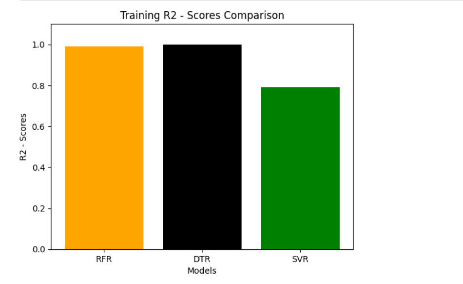
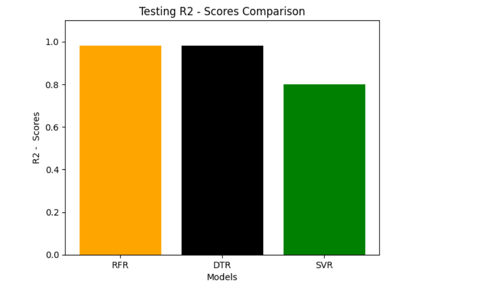

# 🪙 Gold Price Predictor using Regression Models

A Machine Learning project focused on predicting **Gold Prices** using multiple regression algorithms and comparing their performance.

This project demonstrates how different models perform on the same dataset using **R² Score evaluation**.

---

## 📌 Project Overview

This project applies multiple regression models to predict gold prices and compares their performance using:

- Training R² Score
- Testing R² Score

---

## 🧠 Models Used

- 🌲 Random Forest Regressor (RFR)
- 🌳 Decision Tree Regressor (DTR)
- 📈 Support Vector Regressor (SVR)

---

## ⚙️ Technologies Used

- Python  
- Pandas  
- NumPy  
- Matplotlib  
- Scikit-learn  

---

## 📂 Project Structure
---
Gold_Price_Predictor_Regression_Models
├── 📁 Different ML Models Project - Gold Price Prediction/
│ ├── gold_price_prediction.ipynb
│ ├── dataset.csv
│
├── training_r2.png
├── testing_r2.png
│
└── README.md
---

---

## 📊 Model Performance Comparison

### 🔹 Training R² Score Comparison

---

### 🔹 Testing R² Score Comparison

---

## 📈 Insights

- **Decision Tree Regressor (DTR)** shows the highest performance on both training and testing data.
- **Random Forest Regressor (RFR)** also performs very well with slightly lower scores than DTR.
- **Support Vector Regressor (SVR)** performs comparatively lower than tree-based models.

---

## ⚠️ Important Observation

- Very high R² scores (~0.98–1.0) may indicate:
  - Possible **overfitting**, especially for Decision Tree
  - Need for **cross-validation** and tuning

---

## 🚀 How to Run
- pip install pandas numpy matplotlib scikit-learn
- jupyter notebook

Open the notebook and run all cells.

---

## 🎯 Objectives

- Compare multiple regression models
- Understand model performance differences
- Learn evaluation using R² score

---

## 📌 Future Improvements

- Hyperparameter tuning  
- Cross-validation  
- Feature engineering  
- Add more regression models  

---

## ⭐ Support

If you find this project helpful, give it a ⭐ on GitHub!

---

## 📄 License

This project is licensed under the **MIT License**.
